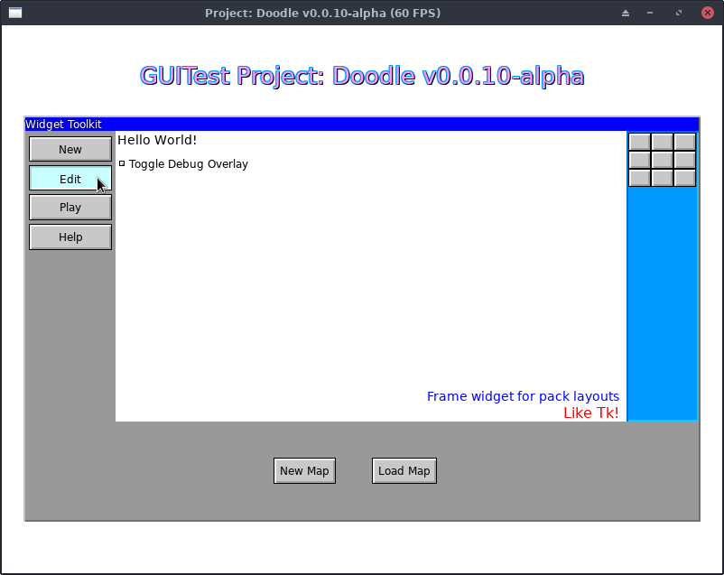

# ui: User Interface Toolkit for Go

[](https://godoc.org/git.kirsle.net/go/ui)

Package ui is a user interface toolkit for Go that targets desktop
applications (SDL2, for Linux, MacOS and Windows) as well as web browsers
(WebAssembly rendering to an HTML Canvas).



> _(Screenshot is from Project: Doodle's GUITest debug screen showing a_
> _Window, several Frames, Labels, Buttons and a Checkbox widget.)_

It is very much a **work in progress** and may contain bugs and its API may
change as bugs are fixed or features added.

This library is being developed in conjunction with my drawing-based maze
game, [Project: Doodle](https://www.kirsle.net/doodle). The rendering engine
library is at [go/render](https://git.kirsle.net/go/render) which provides
the SDL2 and Canvas back-ends.
(GitHub mirror: [kirsle/render](https://github.com/kirsle/render))

**Notice:** the canonical source repository for this project is at
[git.kirsle.net/go/ui](https://git.kirsle.net/go/ui) with a mirror available
on GitHub at [kirsle/ui](https://github.com/kirsle/ui). Issues and pull
requests are accepted on GitHub.

# Example

```go
package main

import (
    "fmt"

    "git.kirsle.net/go/render"
    "git.kirsle.net/go/ui"
)

func main() {
    mw, err := ui.NewMainWindow("Hello World")
    if err != nil {
        panic(err)
    }

    mw.SetBackground(render.White)

    // Draw a label.
    label := ui.NewLabel(ui.Label{
        Text: "Hello, world!",
        Font: render.Text{
            FontFilename: "../DejaVuSans.ttf",
            Size:         32,
            Color:        render.SkyBlue,
            Shadow:       render.SkyBlue.Darken(40),
        },
    })
    mw.Pack(label, ui.Pack{
        Side: ui.N,
        PadY:   12,
    })

    // Draw a button.
    button := ui.NewButton("My Button", ui.NewLabel(ui.Label{
        Text: "Click me!",
        Font: render.Text{
            FontFilename: "../DejaVuSans.ttf",
            Size:         12,
            Color:        render.Red,
            Padding:      4,
        },
    }))
    button.Handle(ui.Click, func(p render.Point) {
        fmt.Println("I've been clicked!")
    })
    mw.Pack(button, ui.Pack{
        Side: ui.N,
    })

    // Add the button to the MainWindow's Supervisor so it can be
    // clicked on and interacted with.
    mw.Add(button)

    mw.MainLoop()
}
```

# Widgets and Features

The following widgets have been implemented or are planned for the future.

Widgets are designed to be composable, making use of pre-existing widgets to
create more complex ones. The widgets here are ordered from simplest to
most complex.

**Fully implemented widgets:**

* [x] **BaseWidget**: the base class of all Widgets.
  * The `Widget` interface describes the functions common to all Widgets,
    such as SetBackground, Configure, MoveTo, Resize, and so on.
  * BaseWidget provides sane default implementations for all the methods
    required by the Widget interface. Most Widgets inherit from
    the BaseWidget.
* [x] **Frame**: a layout wrapper for other widgets.
  * Pack() lets you add child widgets to the Frame, aligned against one side
    or another, and ability to expand widgets to take up remaining space in
    their part of the Frame.
  * Place() lets you place child widgets relative to the parent. You can place
    it at an exact Point, or against the Top, Left, Bottom or Right sides, or
    aligned to the Center (horizontal) or Middle (vertical) of the parent.
* [x] **Label**: Textual labels for your UI.
  * Supports TrueType fonts, color, stroke, drop shadow, font size, etc.
  * Variable binding support: TextVariable or IntVariable can point to a
    string or int reference, respectively, to provide the text of the label
    dynamically.
* [x] **Image**: show a PNG or Bitmap image on your UI.
* [x] **Button**: clickable buttons.
  * They can wrap _any_ widget. Labels are most common but can also wrap a
    Frame so you can have labels + icon images inside the button, etc.
  * Mouse hover and click event handlers.
* [x] **CheckButton** and **RadioButton**
  * Variants on the Button which bind to a variable and toggle its state
    when clicked. Boolean variable pointers are used with CheckButton and
    string pointers for RadioButton.
  * CheckButtons stay pressed in when clicked (true) and pop back out when
    clicked again (false).
  * RadioButtons stay pressed in when the string variable matches their
    value, and pop out when the string variable changes.
* [x] **Checkbox** and **Radiobox**: a Frame widget that wraps a
  CheckButton and a Label to provide a more traditional UI element.
  * Works the same as CheckButton and RadioButton but draws a separate
    label next to a small check button. Clicking the label will toggle the
    state of the checkbox.
* [x] **Window**: a Frame with a title bar Frame on top.
  * Note: Window is not yet draggable or closeable.

**Work in progress widgets:**

* [x] **Menu**: a frame with clickable menu items.
  * To be a base widget behind right-click context menus, pull-down menus
    from a MenuBar, options from a SelectBox and so on.
  * Powered by Frame and Button but with a nice API for composing menu
    actions.
  * Partially implemented so far.
* [ ] **MenuButton**: a Button that opens a Menu when clicked.
* [ ] **MenuBar**: a Frame that houses many MenuButtons, intended for the
  main menu at the top of a UI window (File, Edit, Help, etc.).
* [ ] **Scrollbar**: a Frame including a trough, scroll buttons and a
  draggable slider.

**Wish list for the longer-term future:**

* [ ] **SelectBox:** a kind of MenuButton that lets the user choose a value
  from a list of possible values, bound to a string variable.
* [ ] **WindowManager**: manages Window widgets and focus support for all
  interactable widgets.
  * Would enable Windows to be dragged around by their title bar, overlap
    other Windows, and rise on top of other Windows when clicked.
  * Would enable "focus" support for Buttons, Text Boxes and other
    interactable widgets.
* [ ] **TextBox:** an editable text field that the user can focus and type
  a value into.
  * Would depend on the WindowManager to manage focus for the widgets.

## Supervisor for Interaction

Some widgets that support user interaction (such as Button, CheckButton and
Checkbox) need to be added to the Supervisor which watches over them and
communicates events that they're interested in.

```go
func SupervisorSDL2Example() {
    // NOTE: using the render/sdl engine.
    window := sdl.New("Hello World", 800, 600)
    window.Setup()

    // One Supervisor is needed per UI.
    supervisor := ui.NewSupervisor()

    // A button for our UI.
    btn := ui.NewButton("Button1", ui.NewLabel(ui.Label{
        Text: "Click me!",
    }))

    // Add it to the Supervisor.
    supervisor.Add(btn)

    // Main loop
    for {
        // Check for keyboard/mouse events
        ev, _ := window.Poll()

        // Ping the Supervisor Loop function with the event state, so
        // it can trigger events on the widgets under its care.
        supervisor.Loop(ev)
    }
}
```

You only need one Supervisor instance per UI. Add() each interactive widget
to it, and call its Loop() method in your main loop so it can update the
state of the widgets under its care.

The MainWindow includes its own Supervisor, see below.

## MainWindow for Simple Applications

The MainWindow widget may be used for "simple" UI applications where all you
want is a GUI and you don't want to manage your own SDL2 (or Canvas) engine.

MainWindow is only to be used **one time** per application, and it sets up
its own SDL2 render context and creates the main window. It also contains a
Frame widget for the window contents and you may Pack() widgets into the
window the same as you would a Frame.

MainWindow includes its own Supervisor: just call the `.Add(Widget)`
method to add interactive widgets to the supervisor. The MainLoop() of the
window calls Supervisor.Loop() automatically.

# License

MIT.
