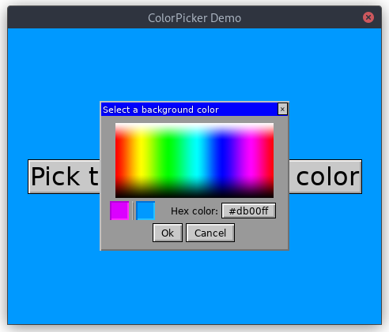

# ColorPicker Demo

This demo shows off the ColorPicker window.

The ColorPicker lets you ask the user to select a color, visually,
using a callback interface. While the UI toolkit doesn't support
text input entry, there is a work-around to prompt the user to enter
a color by hex code with assistance of your program.

In this example program, clicking on the Hex color button will prompt
you via STDIN (check the terminal window!) to enter a color value. The
UI will be frozen until your answer is given. For programs that don't
need this, the Hex color button does nothing when clicked.

## Running It

From your terminal, just type `go run main.go` from this
example's directory.
