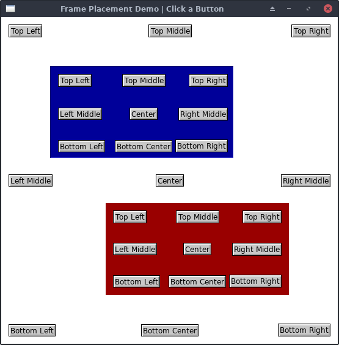

# Frame Placement Example



## About

This demonstrates using the Place() method of the MainWindow and Frame to
position widgets around the window. The MainWindow itself and two child frames
(red and blue) are given the same set of buttons, placed relative to their own
parent widget.

The options for frame placing are:

* **Point:** Absolute X,Y coordinate relative to parent
* **Side:** binding the widget relative to a side of its parent.
  * Top, Bottom, Left and Right to anchor to a side. In Bottom and Right, the
    child widget's size is taken into account, so the right edge of the widget
    would be `Right` pixels from the parent's right edge.
  * Center and Middle options allow to anchor it to the center horizontally or
    middle vertically.

Click any button and the title bar will update to show the name of the
button clicked and which parent it belonged to.

## Run it

```
go run main.go
```
