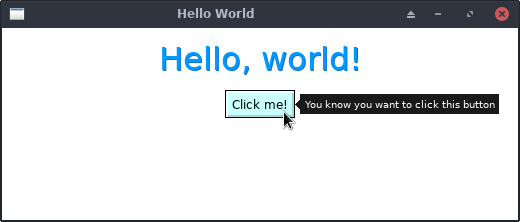

# Hello World

A simple Hello World featuring a Label and a Button. The button logs
to the console window when clicked.

## Running It

From your terminal, just type `go run main.go` from this
example's directory.
