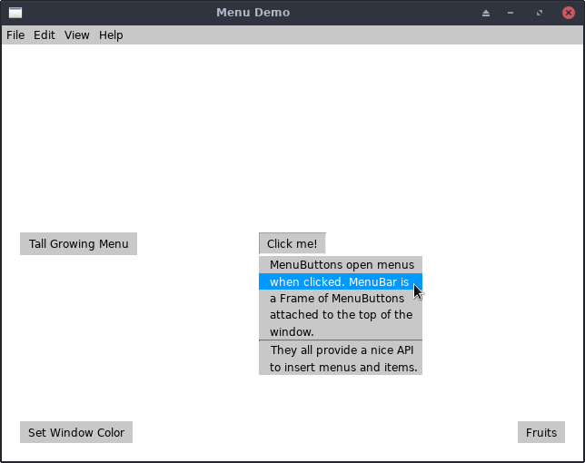
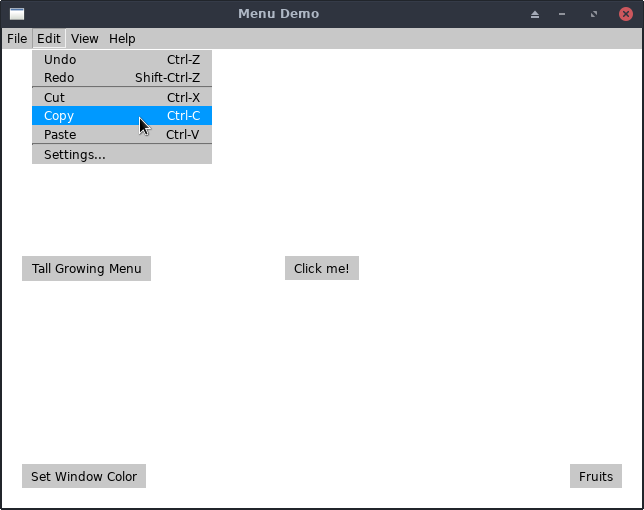
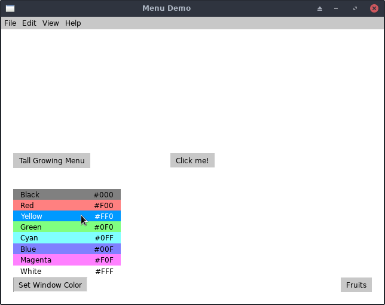

# Menu Example

This example shows off the Menu, MenuButton, and MenuBar widgets.

* MenuButton is your basic button that pops up a Menu when clicked.
* MenuBar is a specialized Frame that attaches to the top of the parent
  (usually the window) and provides a simple API to add menus and items.
* Menu is the underlying "pop-up and select an item" widget.

## Running It

From your terminal, just type `go run main.go` or `make run` from this
example's directory.

## Screenshots

