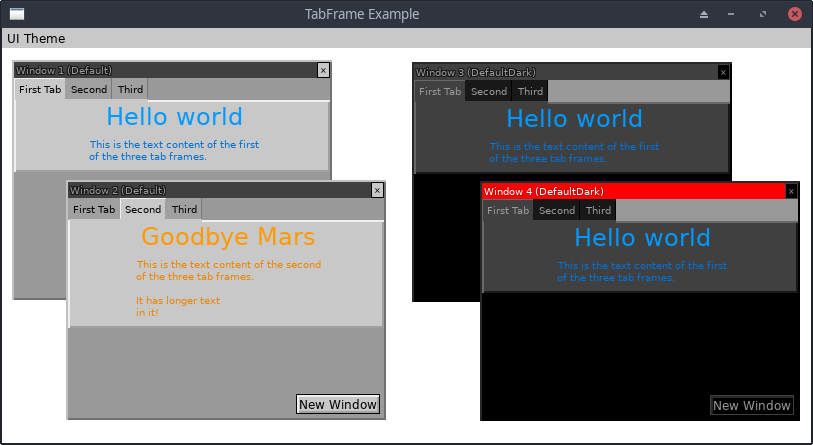

# TabFrame Demo

This demo shows off the TabFrame widget, in multiple copies of a
pop-up Window widget.

## Running It

From your terminal, just type `go run main.go` from this
example's directory.
