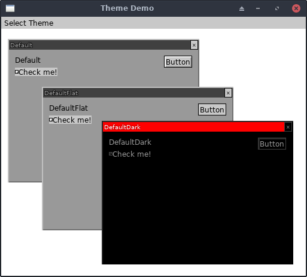

# Themes Example

This demo shows off experimental UI theme support.

The main menu bar lets you open a Window with widgets all using a
selected theme.

## Running It

From your terminal, just type `go run main.go` or `make run` from this
example's directory.
