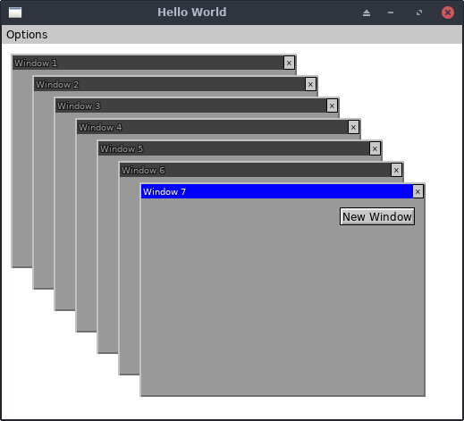

# Windows Demo

This demo lets you open a bunch of Window widgets that can be moved
around, overlapped, and closed.

## Running It

From your terminal, just type `go run main.go` from this
example's directory.
